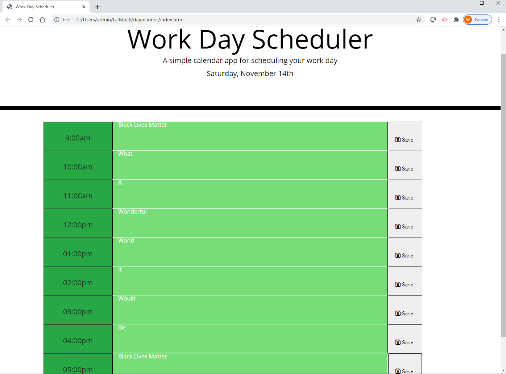

# Work Day Planner
This project required the creation of a simple work day calendar that would allow an employee to schedule important daily events. It color codes the employee's work day into past, present and future hour blocks for even more efficient use of the employees time.  It uses local storage to keep the schedule available even after the app is refreshed.  

## Enhancements 
Using jQuery, CSS, and HTML along with the Moment.js time library the calendar was laid out and formated into hourly blocks that not only labeled the work day hours but color coded them based on past, present or future time from when the application is loaded or refreshed though out the day. It allows the refreshes without losing data as the data is stored locally using the JSON format. 

## Usage 
When viewing the page a sample rendering of the main page is displayed below:

 .

To view the actual page in realtime go to [WorkDayPlanner](https://wpb911.github.io/dayplanner/).

## Contributing
Pull requests are welcome. Feedback is appreciated.

## License

[MIT License](LICENSE)